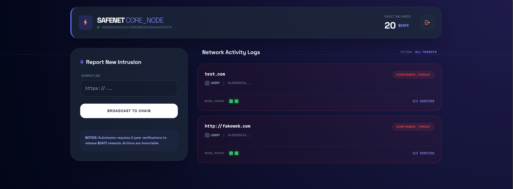

# 🛡️ SafeNet — Decentralized Phishing Protection Network

SafeNet is a **blockchain-powered cybersecurity platform** that decentralizes threat intelligence. Built with a **Security-First philosophy**, it leverages immutable ledgers to store phishing reports and uses community-driven consensus to verify malicious actors.


---

## 🌌 Vision

Traditional blacklists are centralized and vulnerable to tampering or single points of failure.
SafeNet shifts the power to the community.

By rewarding **Good Work** — reporting and verifying threats — SafeNet creates a self-sustaining ecosystem of security sensors that is:

* ✅ Transparent
* 🔒 Immutable
* 🤝 Trustless

---

## 🚀 Key Features

* **Immutable Audit Trail**
  Every report and verification is a permanent blockchain transaction, preventing retroactive manipulation.

* **Consensus-Based Verification**
  Prevents spam and false positives by requiring independent peer confirmations before blacklisting a URL.

* **Incentivized Security ($SAFE Token)**
  Users are rewarded automatically for contributing to the network’s safety.

* **Cyber-Defense Command Center**
  High-performance dashboard with:

  * Glassmorphism UI
  * Real-time network logs
  * Neon data visualization

* **Network Transparency**
  Displays:

  * Reporter username
  * Cryptographic wallet proofs of all verifiers

---

## 🛠️ Technical Stack

**Smart Contracts:**

* Solidity `^0.8.0` (EVM Compatible)

**Backend:**

* Python 3.10+
* Flask
* Web3.py

**Frontend:**

* Tailwind CSS
* JavaScript (ES6)
* Glassmorphism Design

**Local Blockchain:**

* Ganache (Truffle Suite)

---

## 📂 Project Structure

```
safenet/
├── app.py              # Flask server & Web3 logic
├── SafeNet.sol         # Solidity Smart Contract (Reward Engine)
├── templates/
│   └── index.html      # High-tech Cyber-Vibe Frontend
├── requirements.txt    # Python dependencies
├── LICENSE             # MIT License
└── README.md           # Project Documentation
```

---

## 🔧 Installation & Setup

### 1️⃣ Prerequisites

* Python **3.10+**
* Ganache UI running on `http://127.0.0.1:7545`
* Remix IDE for smart contract deployment

---

### 2️⃣ Smart Contract Deployment

1. Open `SafeNet.sol` in **Remix IDE**
2. In **Solidity Compiler**, set EVM Version to `paris` or `london`
3. Compile the contract
4. Go to **Deploy & Run Transactions**
5. Set Environment to **Dev - Ganache Provider**
6. Deploy and save:

   * Contract Address
   * ABI

---

### 3️⃣ Backend Configuration

Clone the repository:

```bash
git clone ----------{url}/safenet.git
cd safenet
pip install -r requirements.txt
```

Open `app.py` and update:

* `CONTRACT_ADDRESS` → your deployed contract address
* `CONTRACT_ABI` → your contract ABI array
* `USERS` → map Ganache account addresses to usernames

Example:

```python
USERS = {
    "admin": {"password": "123", "address": w3.eth.accounts[0]},
    "user1": {"password": "123", "address": w3.eth.accounts[1]},
    "user2": {"password": "123", "address": w3.eth.accounts[2]}
}
```

---

### 4️⃣ Run the Application

```bash
python app.py
```

Open your browser at:

```
http://127.0.0.1:5000
```

Welcome to the **Cyber-Defense Core** 🧠⚡




---

## 🛡️ Security Logic (Proof of Contribution)


### 🧾 Reporting

A user submits a suspicious URL.
The blockchain records:

* Reporter address
* Username
* Cryptographic hash of the site

---

### 🔍 Verification

Other nodes review the report.

Safeguards:

* Reporter **cannot verify their own submission**
* Requires **2 independent verifications**

---

### 💰 Reward Trigger

Once consensus is reached:

* **Reporter:** +10 `$SAFE` tokens
* **Each Verifier:** +2 `$SAFE` tokens

---

### 🔐 Finality

After reaching the verification threshold:

* URL is **permanently blacklisted**
* Entry becomes immutable on-chain

---

## 📜 License

Distributed under the **MIT License**.
See `LICENSE` for more information.

---
